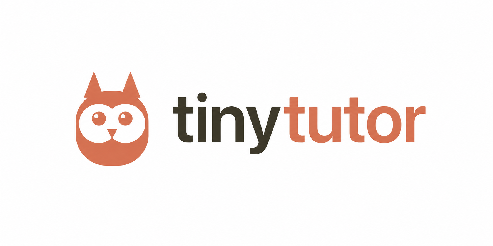

# tinytutor



Quizzes you on the code Claude Code just wrote, so you actually understand the project you're shipping.

If you're building with Claude Code, it's easy to end up with a working app you couldn't explain in an interview. tinytutor hooks into Claude Code's own session lifecycle: every time it finishes a meaningful chunk of work (a threshold of changed lines or files), the next time it tries to write more code, it pauses and quizzes you first - in the same chat, using its own context of the code it just wrote. Answer wrong or say "I don't know" and it gives you a plain-English explanation instead of moving on. Over time it remembers which topics you've struggled with and re-tests them.

No separate process, no extra API key, zero runtime dependencies.

## Install

```bash
cd your-project
npx tinytutor init
```

That's it. `init`:

- Requires the project to be a git repo (milestone detection is diff-based - run `git init` first if it isn't one yet)
- Sets a checkpoint at your current `HEAD`
- Registers a `Stop` hook and a `PreToolUse` hook in `.claude/settings.json`, without touching any other settings you already have there
- Creates `.tinytutor/state.json` (checkpoint + thresholds) and `.tinytutor/memory.json` (quiz history)

Nothing else to run. The next time Claude Code wraps up a substantial chunk of work in this project and then tries to write more code, it'll check in with you first.

## How it works

This went through several real redesigns during testing, because the naive approach doesn't actually work - worth understanding why:

**`Stop` fires after every turn, not just when a session truly ends** - including the completely normal case where Claude asks a question and is legitimately waiting for you to reply. Blocking `Stop` (exit code 2) doesn't mean "pause and wait for the human" - it means "don't hand control back to the terminal at all," which forces Claude to regenerate immediately with no chance for you to actually answer. So `Stop` here is **non-blocking**: it only detects milestones and stashes the diff.

**A non-blocking `Stop` hook's stdout, added as plain context, turned out to be silently ignored** by Claude in practice - it never surfaced in an actual response. So the real quiz content isn't delivered there.

**What actually works: `PreToolUse`.** It fires before a specific `Edit`/`Write`/`MultiEdit`/`NotebookEdit`/`Bash` call, not at every turn boundary, so blocking it doesn't trap you in an unanswerable loop - Claude simply can't make that particular change yet. `Bash` is included (with a heuristic filter - see below) because Claude can otherwise route around the whole gate with a shell command like `rm file.py`, which was found happening in real testing.

**Claude Code always shows a blocked tool call's reason to the user, no matter which denial mechanism is used** - there's no way to make that fully invisible. So the visible line stays a short, generic one-liner; the actual quiz content (diff, files, questions) goes in the `additionalContext` field instead, which Claude reads and acts on without it being displayed.

**Instructing Claude to "hide" or "not mention" the check-in backfired** - that phrasing reads structurally like a prompt injection (a hidden instruction telling a model to conceal something from the user it's talking to), and Claude's own safety training occasionally flagged and refused it. The fix was to make the instruction explicitly transparent instead: this is a known, opted-in feature, not a secret, so there's nothing to hide.

Put together:

1. On `Stop`, tinytutor snapshots your working tree (tracked, modified, and untracked files - anything not gitignored) as an out-of-band git commit, without touching your real index, branch, or HEAD, and diffs it against the last checkpoint.
2. If the delta crosses the configured threshold (default: 80 changed lines or 3 changed files), that's a milestone - tinytutor stashes the diff and marks a quiz as pending. Nothing is shown yet.
3. The next time Claude tries to change a file (via Edit/Write/MultiEdit/NotebookEdit, or a file-modifying Bash command), `PreToolUse` denies that call and hands Claude the real quiz via `additionalContext`: open transparently, ask questions one at a time based on the actual diff, explain wrong answers simply, and write a summary to `.tinytutor/memory.json` (that specific write is exempted from the gate, so Claude can always close the loop - and it's told never to claim an edit succeeded if it was actually blocked).
4. Once `memory.json` shows the quiz completed, the gate lifts - Claude's original edit (and the checkpoint) both go through normally. If something goes wrong and the same quiz gets denied an unreasonable number of times in a row, tinytutor force-closes it rather than deadlocking every future edit.

Nothing here calls a separate LLM or needs its own API key - it rides entirely on the Claude Code session that's already running.

## Commands

```bash
tinytutor init [--force]      # set up tinytutor in the current project
tinytutor status               # show checkpoint, pending quiz, and weak topics
tinytutor stop-hook             # (internal) invoked by Claude Code's Stop hook
tinytutor pre-tool-use-hook     # (internal) invoked by Claude Code's PreToolUse hook
```

## Configuring thresholds

Edit `.tinytutor/state.json`:

```json
{
  "config": {
    "linesThreshold": 80,
    "filesThreshold": 3
  }
}
```

Lower thresholds mean more frequent, smaller quizzes; higher thresholds mean fewer, larger ones. Question count scales with the size of the diff (3 questions for a small milestone, up to 10 for a large one) - Claude is instructed to touch every changed file at least once but never invent questions about code that isn't actually in the diff, so a quiz may legitimately end early if there's nothing left to genuinely ask about.

## Known limitations

- **Quiz only surfaces on the next edit attempt, not immediately.** Since the only reliable delivery channel is `PreToolUse`, if you cross a milestone and then never ask Claude to write more code in that session, the quiz never actually appears (there's nothing to block). In an active coding session this is rarely an issue - the next edit attempt usually isn't far off.
- **The Bash gate is a heuristic, not a hard guarantee.** It matches common file-modifying patterns (`rm`, `mv`, `sed -i`, redirection, destructive git operations) so a pending quiz doesn't leave the whole shell unusable - but a sufficiently unusual command could still slip through.
- **Requires git.** Milestone detection is diff-based. Projects without git aren't supported yet.
- **`git log --all` will show tinytutor's checkpoint commits.** They live under `refs/tinytutor/checkpoint`, never touch your branch or index, and are invisible to a normal `git log`/`git status` - but `--all` walks every ref, so you may notice a `tinytutor checkpoint` commit if you look there. Harmless, just cosmetic.
- **Single project scope.** State and memory are per-project (`.tinytutor/`), not global across all your projects yet.

## License

MIT
