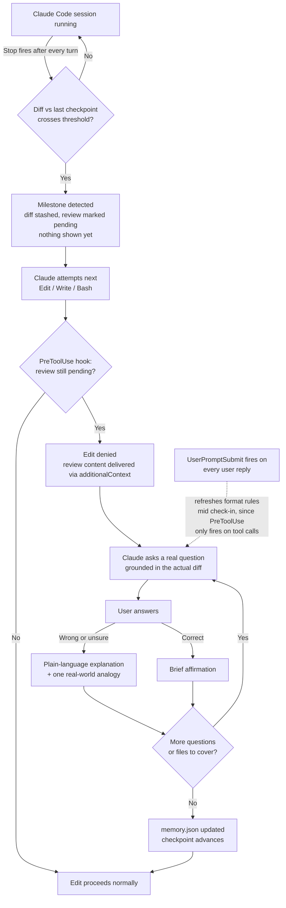

# tinytutor


**A comprehension checkpoint for AI-assisted development.**

AI coding assistants make it trivially easy to ship code you never actually understood. tinytutor closes that gap: it integrates directly into a Claude Code session and, at defined milestones in the work, verifies that you can explain what was just built before you're allowed to keep building. Incorrect or uncertain answers are met with a plain-language explanation, not a pass. Over time, tinytutor tracks the concepts you consistently struggle with and brings them back for review.

The result is engineering output you can actually stand behind: in a code review, in production, in an interview.

No background service, no additional API key, no runtime dependencies. It runs entirely inside the Claude Code session you already have open.

[](https://www.npmjs.com/package/tinytutor)
[](https://www.npmjs.com/package/tinytutor)
[](#license)
[](#by-the-numbers)
[](#by-the-numbers)

---

## Table of contents

- [Why this exists](#why-this-exists)
- [Install](#install)
- [Architecture](#architecture)
- [How it works](#how-it-works)
- [Design decisions and dead ends](#design-decisions-and-dead-ends)
- [Commands](#commands)
- [Configuring thresholds](#configuring-thresholds)
- [By the numbers](#by-the-numbers)
- [Known limitations](#known-limitations)
- [License](#license)

---

## Why this exists

This isn't a hypothetical problem. It's showing up in the data across multiple independent studies in 2025:

| Finding | Source |
|---|---|
| 59% of developers use AI-generated code they don't fully understand | [Clutch, 2025](https://clutch.co/resources/devs-use-ai-generated-code-they-dont-understand) |
| 45% of developers say debugging AI-generated code costs them significant time; 66% say AI answers are "almost right, but not quite" | [Stack Overflow Developer Survey, 2025](https://stackoverflow.co/company/press/archive/stack-overflow-2025-developer-survey/) |
| 43% of AI-generated code changes need debugging once they reach production | [VentureBeat, 2025](https://venturebeat.com/technology/43-of-ai-generated-code-changes-need-debugging-in-production-survey-finds/) |
| Experienced open-source developers were **19% slower** with AI tools on real issues in codebases they already knew, despite *believing* AI had made them 20% faster | [METR randomized controlled trial, 2025](https://metr.org/blog/2026-02-24-uplift-update/) ([arXiv:2507.09089](https://arxiv.org/abs/2507.09089)) |
| Refactored ("moved") code fell from 25% of changed lines (2021) to under 10% (2024), while copy-pasted code rose from 8.3% to 12.3%. 2024 was the first year on record where copy-paste exceeded refactoring | [GitClear, 211M lines analyzed, 2025](https://www.gitclear.com/ai_assistant_code_quality_2025_research) |
| Code churn (lines reverted or rewritten within two weeks of being authored) is projected to double versus the pre-AI 2021 baseline | [GitClear, 2025](https://www.gitclear.com/ai_assistant_code_quality_2025_research) |

The pattern across all five: **adoption of AI coding tools is rising sharply while comprehension, trust, and code durability are all falling.** Engineers are shipping faster and understanding less, and the studies suggest that gap is what's actually slowing teams down later, through debugging, churn, and rework, not the initial generation step.

tinytutor doesn't try to make the AI write better code. It makes sure the human in the loop can still explain the code that got written, before there's more of it to lose track of.

## Install

```bash
cd your-project
npx tinytutor init
```

`init` will:

- Require the project to be a git repository (milestone detection is diff-based, so run `git init` first if needed)
- Set a checkpoint at the current `HEAD`
- Register `Stop`, `PreToolUse`, and `UserPromptSubmit` hooks in `.claude/settings.json`, without altering any existing settings
- Create `.tinytutor/state.json` (checkpoint and thresholds) and `.tinytutor/memory.json` (review history)

There is nothing else to run. The next time Claude Code completes a substantial unit of work in this project and attempts to write further code, tinytutor will engage first.

## Architecture



Three Claude Code hook events do the work, each chosen for a specific reason discovered through testing, not by default:

| Hook | Fires on | Role in tinytutor | Can it block? |
|---|---|---|---|
| `Stop` | Every conversational turn ending | Silently detects milestones and snapshots the diff | No, deliberately non-blocking (see below) |
| `PreToolUse` | Before `Edit` / `Write` / `MultiEdit` / `NotebookEdit` / file-modifying `Bash` | Delivers the actual review content and denies the edit until it's answered | Yes, this is the real gate |
| `UserPromptSubmit` | Every message the user sends | Re-injects the format rules mid-review, since nothing else fires between questions | No, non-blocking context refresh |

## How it works

1. On `Stop`, tinytutor snapshots the working tree (tracked, modified, and untracked files not covered by `.gitignore`) as an out-of-band git commit. This never touches the real index, branch, or `HEAD`; it lives under `refs/tinytutor/checkpoint`. It then diffs that snapshot against the last recorded checkpoint.
2. If the delta crosses the configured threshold (80 changed lines or 3 changed files by default, lockfiles excluded), that's a milestone. tinytutor stores the diff and marks a review as pending. Nothing is shown to the user yet.
3. The next time Claude attempts to modify a file, `PreToolUse` denies that call and passes Claude the actual review content through `additionalContext`: ask questions one at a time based on the real diff, explain incorrect answers plainly with an analogy, and record a summary in `.tinytutor/memory.json` (that specific write is exempt from the gate, so the loop can always be closed).
4. Between questions, `UserPromptSubmit` quietly re-sends the formatting rules on every reply, since `PreToolUse` only fires on tool call attempts and there typically aren't any mid-conversation.
5. Once `memory.json` reflects a completed review, the gate lifts and the original edit proceeds normally, along with the checkpoint advance. If a single review is denied an unreasonable number of times in a row (12+), tinytutor force-closes it rather than deadlocking every subsequent edit.

No separate model call and no independent API key are involved. Everything rides on the Claude Code session already in progress.

## Design decisions and dead ends

The architecture above is the result of several real failures found through testing against live Claude Code sessions, not a first draft. Each row below is a genuine dead end that shipped, broke, and got replaced.

| Tried | What actually happened | What we do instead |
|---|---|---|
| Block the `Stop` hook to force a wait-for-answer loop | `Stop` fires after *every* turn, including a normal "Claude asked a question, waiting for reply." Blocking it doesn't pause for the human, it prevents Claude Code from ever returning control to the terminal at all, forcing the model to regenerate with no chance for a real answer | `Stop` is strictly non-blocking; it only detects milestones |
| Nudge Claude via a `Stop` hook's non-blocking stdout context | Silently ignored in practice. Never surfaced in an actual response, confirmed by direct testing | Deliver content via `PreToolUse`'s `additionalContext` instead, the one channel confirmed to actually reach Claude |
| Put the full review (diff, questions, instructions) in the visible deny reason | Claude Code always shows a blocked tool call's reason to the user verbatim, so this rendered as a wall of raw text in the terminal | Keep the visible reason short and generic; move the real content to `additionalContext`, which Claude reads but doesn't display |
| Instruct Claude to avoid mentioning the check-in to the user | Read structurally like a prompt injection (a hidden instruction telling a model to conceal something from the person it's talking to). Claude's own safety training occasionally flagged and refused it | Make the instruction explicitly transparent: this is a feature the user installed and expects, nothing to hide |
| Force Claude to reproduce the ASCII banner character-for-character in its own reply | Same injection-shaped pattern as above, made refusals *more* likely, not less | Dropped; branding lives only in the one channel that's guaranteed literal without needing the model to comply |
| Trust that Claude only asks about real, already-written code | Occasionally asked about a *planned* edit that hadn't happened yet, since it was still fresh in conversational context | Explicit instruction: only ask about lines literally present in the stored diff, verified before each question |
| Trust a single completion signal at the end of a review | No hard cap meant a stuck review could theoretically loop forever if Claude never wrote the summary | Added a deny-count safety valve: after 12 unresolved denials, tinytutor force-closes the review rather than deadlocking every future edit |

## Commands

```bash
tinytutor init [--force]           # set up tinytutor in the current project
tinytutor status                    # show checkpoint, pending review, and weak topics
tinytutor quiz                      # manually trigger a review on the current diff, on demand
tinytutor uninstall                 # remove tinytutor's hooks from .claude/settings.json
tinytutor stop-hook                  # (internal) invoked by Claude Code's Stop hook
tinytutor pre-tool-use-hook          # (internal) invoked by Claude Code's PreToolUse hook
tinytutor user-prompt-submit-hook    # (internal) invoked by Claude Code's UserPromptSubmit hook
```

## Configuring thresholds

Edit `.tinytutor/state.json`:

```json
{
  "config": {
    "linesThreshold": 80,
    "filesThreshold": 3,
    "excludePatterns": ["package-lock.json", "pnpm-lock.yaml", "yarn.lock"]
  }
}
```

| Setting | Default | Effect |
|---|---|---|
| `linesThreshold` | `80` | Changed lines since last checkpoint needed to trigger a review |
| `filesThreshold` | `3` | Changed files since last checkpoint needed to trigger a review |
| `excludePatterns` | lockfiles | Paths ignored entirely when computing the diff, so auto-generated lockfile churn never counts toward or pollutes a review |

Lower thresholds trigger more frequent, smaller reviews; higher thresholds trigger fewer, larger ones. Question count scales with the size of the diff (3 questions for a small milestone, up to 10 for a large one). Claude is instructed to touch every changed file at least once, weigh questions toward system design when the diff spans multiple interacting components, and never invent questions about code that isn't actually present in the diff, so a review may legitimately end early once there's nothing further to genuinely ask.

## By the numbers

| Metric | Value |
|---|---|
| Runtime dependencies | 0 |
| Source (`src/`) | ~1,050 lines of JavaScript |
| Automated tests | 41, using Node's built-in `node:test`, no test framework dependency |
| Hook events used | 3 (`Stop`, `PreToolUse`, `UserPromptSubmit`) |
| Node.js required | >= 18 |
| Published package size | ~787 KB (mostly the logo asset; the code itself is a few tens of KB) |
| Default review trigger | 80 changed lines or 3 changed files |
| Questions per review | 3 to 10, scaled to diff size |
| Safety valve | force-closes an unresolved review after 12 denials |

## Known limitations

- **The review surfaces on the next edit attempt, not immediately.** Since `PreToolUse` is the only reliable delivery channel, if a milestone is crossed and Claude is never asked to write further code in that session, the review never actually appears; there is nothing to deny. In an active coding session this is rarely relevant, since the next edit attempt is usually close behind.
- **The Bash gate is a heuristic, not a guarantee.** It matches common file-modifying patterns (`rm`, `mv`, `sed -i`, redirection, destructive git operations) so a pending review does not make the shell unusable, but an unusual enough command could still slip through.
- **Git is required.** Milestone detection is diff-based, so projects without git are not yet supported.
- **`git log --all` will surface tinytutor's checkpoint commits.** They live under `refs/tinytutor/checkpoint`, never touch the branch or index, and are invisible to a normal `git log` or `git status`; `--all` walks every ref, so a `tinytutor checkpoint` commit may appear there. This is cosmetic and harmless.
- **State is per-project.** Checkpoints and review history live in `.tinytutor/`, scoped to the current project rather than shared globally.
- **Claude Code only, for now.** The hook mechanism this relies on is specific to Claude Code; most other coding agents don't expose an equivalent interception point yet.

## License

MIT
